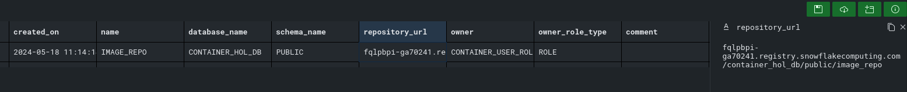
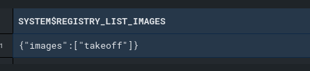
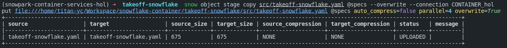
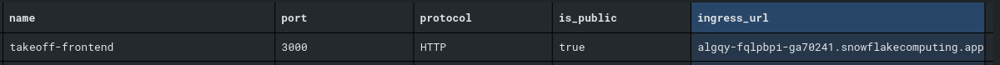
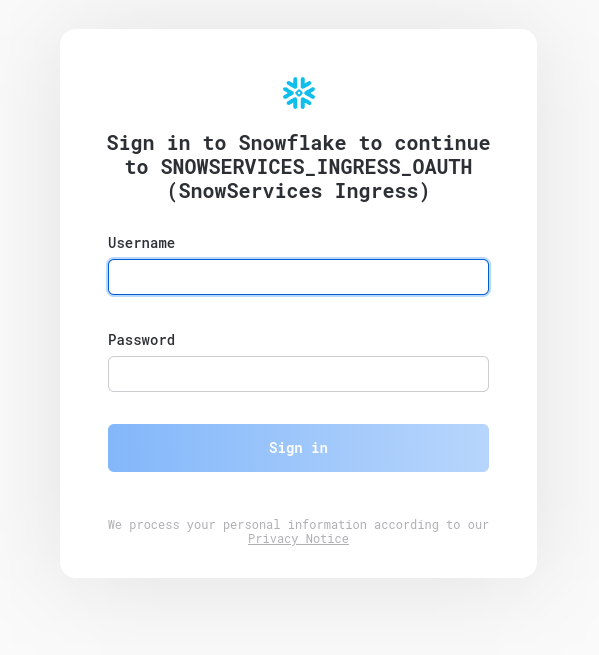
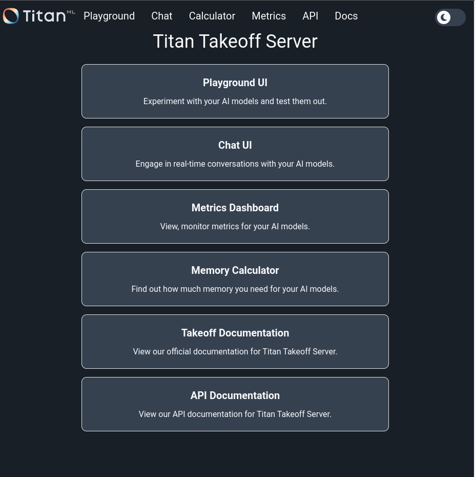

# Integration Guide: Takeoff with Snowflake

## Table of Contents

- [Project Title](#project-title)
  - [Table of Contents](#table-of-contents)
  - [About ](#about-)
  - [Getting Started ](#getting-started-)
    - [Prerequisites](#prerequisites)
    - [Step by step guide](#step-by-step-guide)

## About <a name = "about"></a>

This guide will help you integrate Takeoff with Snowflake by pushing images to Snowpark Container Services and setting up a service using a YAML spec file.

## Getting Started <a name="getting_started"></a>

Begin by familiarizing yourself with the foundational concepts and configurations required for Snowpark Container Services. A detailed introduction and step-by-step setup can be found in the official [Snowflake Quickstart Guide](https://quickstarts.snowflake.com/guide/intro_to_snowpark_container_services/index.html#0).

### Prerequisites

Before you start, ensure you have the following:
- A non-trial Snowflake account with `ACCOUNTADMIN` role privileges.
- Visual Studio Code installed with the Snowflake extensions enabled.
  
This setup is essential for managing the Snowflake configurations and executing SQL scripts necessary for the integration.

### Step by Step Guide

Follow these detailed steps to complete the integration of Takeoff with Snowflake. Each step includes precise actions required to configure and verify each part of the process, ensuring a successful setup. Please refer to the main setup guide for detailed commands and further instructions on executing SQL scripts and managing Docker images within Snowflake.


### Step by step guide

Step1. once you have the non-trial snowflake account and vscode extension setup, you need to connect to it in vscode. 
Step2. Run the setup_00.sql for setting up the role, database, warehouse, and stages required for the Snowpark Container Service
Step3. Run the setup_01.sql for setting up the OAuth integration, network rules, and compute pool (GPU) required for the Snowpark 

Step 4. 
After successfully setup, you can view the `image repositories` using the following SQL command:
```
SHOW IMAGE REPOSITORIES IN SCHEMA CONTAINER_HOL_DB.PUBLIC;
```

You will see the results like this:


check the repository_url field and this is your snowflake REPOSITORY_URL, for example in my case this is 

fqlpbpi-ga70241.registry.snowflakecomputing.com/container_hol_db/public/image_repo

and your snowflake SNOWFLAKE_REGISTRY_HOSTNAME is fqlpbpi-ga70241.registry.snowflakecomputing.com

notice the difference 


Step 5.
Now you can login to that repository using docker cli. You can do the following command:

```
docker login <snowflake_registry_hostname> -u <username>
```

Step 6.
After successfully login, we can now push the takeoff image to the remote repo by:


```bash 
# `tytn/takeoff:0.14.3-gpu` is the takeoff image, notice here we give a tag dev for just testing case
docker tag tytn/takeoff:0.14.3-gpu <REPOSITORY_URL>/takeoff:dev

# and then push to the remote repo 
docker push <REPOSITORY_URL>/takeoff:dev
```

Step 7. verify the image 

You can use the following SQL command to verify if the image is listed in snowpark registry

```sql
USE ROLE CONTAINER_USER_ROLE;
CALL SYSTEM$REGISTRY_LIST_IMAGES('/CONTAINER_HOL_DB/PUBLIC/IMAGE_REPO');
```

You should see the result like this:


Now you have succesfully pushed the takeoff image to snowpark registry. The next section we will guide you through how to create a service connected snowflake from takeoff 

Section 2 Create a service

Step 8. To create a service, we need to have a Spec YAML for Snowpark Container Services

In the repo, I have put a `takeoff-snowflake.yaml` as an exmaple yaml we are gonna push to Snowpark Container Services. 

In order to push the yaml file, we will need the snowflake cli setup. 

You can install snowflake cli by following the `Python Virtual Environment and SnowCLI` Section in this tutorial https://quickstarts.snowflake.com/guide/intro_to_snowpark_container_services/index.html#2


Once you have the snow cli setup succesfully, you can run the following command to push the sepc yaml file
```
snow object stage copy src/takeoff-snowflake.yaml @specs --overwrite --connection CONTAINER_hol
```

You can verify that your yaml was pushed successfully by running the following SQL
```sql
USE ROLE CONTAINER_USER_ROLE;
LS @CONTAINER_HOL_DB.PUBLIC.SPECS;
```

You should see the results like this:



Step 9. create a service and test the service

We are getting there, now you can run the sql command in `takeoff_service.sql` to create a service using the spec yaml file. 

After that, you can do the following the check if the status and logs:

```sql
// Test takeoff service: get service status
CALL SYSTEM$GET_SERVICE_STATUS('CONTAINER_HOL_DB.PUBLIC.TAKEOFF_SERVICE');


// Test takeoff service: get service logs, -> get last 50 lines of logs
CALL SYSTEM$GET_SERVICE_LOGS('CONTAINER_HOL_DB.PUBLIC.TAKEOFF_SERVICE', '0', 'takeoff',50);
```


Step 10. Verify and try takeoff using the frontend

now you can do the following command to get the ingress url:
```
// Show endpoints in service
SHOW ENDPOINTS IN SERVICE TAKEOFF_SERVICE;
```


You will see something like this:




Now you can use your favourate browser go to the ingress url and try out takeoff!



Enter your username and password and then you should see takeoff frontend:




## Step-by-Step Setup Guide

### Step 1: Connect to Snowflake in VSCode
Ensure you have the VSCode Snowflake extension setup and connect to your Snowflake account.

### Step 2: Initialize Snowpark Environment
Execute the `setup_00.sql` to set up the roles, databases, warehouses, and stages required for Snowpark Container Services.

### Step 3: Configure OAuth and Compute Resources
Run `setup_01.sql` to configure OAuth, network policies, and compute resources (GPU).

### Step 4: Verify Image Repositories
Use the SQL command below to list your image repositories:

```sql
SHOW IMAGE REPOSITORIES IN SCHEMA CONTAINER_HOL_DB.PUBLIC;
```

- **Example Output**: `fqlpbpi-ga70241.registry.snowflakecomputing.com/container_hol_db/public/image_repo`
- Note the URL for the repository and the registry hostname.

### Step 5: Docker Login
Login to the Snowflake repository using the Docker CLI:

```bash
docker login <snowflake_registry_hostname> -u <username>
```

### Step 6: Push the Takeoff Image
Tag and push the Takeoff image to the remote repository:

```bash
docker tag tytn/takeoff:0.14.3-gpu <REPOSITORY_URL>/takeoff:dev
docker push <REPOSITORY_URL>/takeoff:dev
```

### Step 7: Verify the Image Upload
Check if the image is successfully listed in the Snowpark registry:

```sql
USE ROLE CONTAINER_USER_ROLE;
CALL SYSTEM$REGISTRY_LIST_IMAGES('/CONTAINER_HOL_DB/PUBLIC/IMAGE_REPO');
```

### Creating a Service with Snowflake

### Step 8: Prepare the Spec YAML
Ensure the Snowflake CLI is installed (refer to [Snowflake's Quickstart Guide](https://quickstarts.snowflake.com/guide/intro_to_snowpark_container_services/index.html#2)). Push the `takeoff-snowflake.yaml` file:

```bash
snow object stage copy src/takeoff-snowflake.yaml @specs --overwrite --connection CONTAINER_hol
```

### Step 9: Create and Test the Service
Create the service using `takeoff_service.sql` and verify its status:

```sql
CALL SYSTEM$GET_SERVICE_STATUS('CONTAINER_HOL_DB.PUBLIC.TAKEOFF_SERVICE');
CALL SYSTEM$GET_SERVICE_LOGS('CONTAINER_HOL_DB.PUBLIC.TAKEOFF_SERVICE', '0', 'takeoff', 50);
```

### Step 10: Access Takeoff via Ingress URL
Retrieve the service endpoint:

```sql
SHOW ENDPOINTS IN SERVICE TAKEOFF_SERVICE;
```

Visit the URL in your browser to interact with the Takeoff frontend.

---
