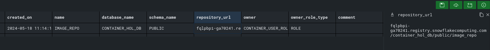
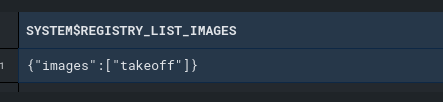
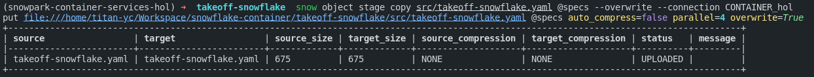
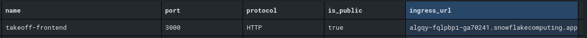
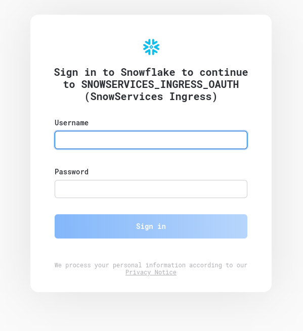

# Integration Guide: Takeoff with Snowflake

## Table of Contents

- [Integration Guide: Takeoff with Snowflake](#integration-guide-takeoff-with-snowflake)
  - [Table of Contents](#table-of-contents)
  - [About ](#about-)
  - [Getting Started ](#getting-started-)
    - [Prerequisites](#prerequisites)
  - [Step-by-Step Setup Guide](#step-by-step-setup-guide)
    - [Step 1: Connect to Snowflake in VSCode](#step-1-connect-to-snowflake-in-vscode)
    - [Step 2: Initialize Snowpark Environment](#step-2-initialize-snowpark-environment)
    - [Step 3: Configure OAuth and Compute Resources](#step-3-configure-oauth-and-compute-resources)
    - [Step 4: Verify Image Repositories](#step-4-verify-image-repositories)
    - [Step 5: Docker Login](#step-5-docker-login)
    - [Step 6: Push the Takeoff Image](#step-6-push-the-takeoff-image)
    - [Step 7: Verify the Image Upload](#step-7-verify-the-image-upload)
  - [Creating a Service with Snowflake](#creating-a-service-with-snowflake)
    - [Step 8: Prepare the Spec YAML](#step-8-prepare-the-spec-yaml)
    - [Step 9: Create and Test the Service](#step-9-create-and-test-the-service)
    - [Step 10: Access Takeoff via Ingress URL](#step-10-access-takeoff-via-ingress-url)
  - [Optional: Use Takeoff in Snowflake Function](#optional-use-takeoff-in-snowflake-function)
    - [Creating the Function](#creating-the-function)
    - [Testing the Function](#testing-the-function)
    - [End-to-End Example](#end-to-end-example)

## About <a name = "about"></a>

This guide will help you integrate Takeoff with Snowflake by pushing images to Snowpark Container Services and setting up a service using a YAML spec file.

## Getting Started <a name="getting_started"></a>

Begin by familiarizing yourself with the foundational concepts and configurations required for Snowpark Container Services. A detailed introduction and step-by-step setup can be found in the official [Snowflake Quickstart Guide](https://quickstarts.snowflake.com/guide/intro_to_snowpark_container_services/index.html#0).

### Prerequisites

Before you start, ensure you have the following:

- A non-trial Snowflake account with `ACCOUNTADMIN` role privileges.
- Visual Studio Code installed with the Snowflake extensions enabled.

This setup is essential for managing the Snowflake configurations and executing SQL scripts necessary for the integration.

## Step-by-Step Setup Guide

Follow these detailed steps to complete the integration of Takeoff with Snowflake. Each step includes precise actions required to configure and verify each part of the process, ensuring a successful setup. Please refer to the main setup guide for detailed commands and further instructions on executing SQL scripts and managing Docker images within Snowflake.

### Step 1: Connect to Snowflake in VSCode

Ensure you have the VSCode Snowflake extension setup and connect to your Snowflake account.

### Step 2: Initialize Snowpark Environment

Execute the `setup_00.sql` to set up the roles, databases, warehouses, and stages required for Snowpark Container Services.

### Step 3: Configure OAuth and Compute Resources

Run `setup_01.sql` to configure OAuth, network policies, and compute resources (GPU).

**_Updated 07/23/2024_ Dataiku Plugin OAuth Integration**: If integrating with the Dataiku plugin, run `setup_01_dataiku.sql` instead.

### Step 4: Verify Image Repositories

Use the SQL command below to list your images repositories:

```sql
SHOW IMAGE REPOSITORIES IN SCHEMA CONTAINER_HOL_DB.PUBLIC;
```

**Example Output**:


- **Important**: Notice the difference between REPOSITORY_URL and REGISTRY_HOSTNAME:

```
# example output
REPOSITORY_URL: fqlpbpi-ga70241.registry.snowflakecomputing.com/container_hol_db/public/image_repo
REGISTRY_HOSTNAME: fqlpbpi-ga70241.registry.snowflakecomputing.com
```

### Step 5: Docker Login

Login to the Snowflake repository using the Docker CLI:

```bash
docker login <REGISTRY_HOSTNAME> -u <username>
```

### Step 6: Push the Takeoff Image

Tag and push the Takeoff image to the remote repository:

```bash
docker tag tytn/takeoff:0.14.3-gpu <REPOSITORY_URL>/takeoff:dev
docker push <REPOSITORY_URL>/takeoff:dev
```

### Step 7: Verify the Image Upload

Check if the image is successfully listed in the Snowpark registry:

```sql
USE ROLE CONTAINER_USER_ROLE;
CALL SYSTEM$REGISTRY_LIST_IMAGES('/CONTAINER_HOL_DB/PUBLIC/IMAGE_REPO');
```

**Example Output**:


## Creating a Service with Snowflake

### Step 8: Prepare the Spec YAML

Ensure the Snowflake CLI is installed (refer to [Snowflake's Quickstart Guide](https://quickstarts.snowflake.com/guide/intro_to_snowpark_container_services/index.html#2)). Push the `takeoff-snowflake.yaml` file:

```bash
snow object stage copy src/takeoff-snowflake.yaml @specs --overwrite --connection CONTAINER_hol
```

**Example Output**:


### Step 9: Create and Test the Service

Create the service using `takeoff_service.sql` and verify its status:

```sql
CALL SYSTEM$GET_SERVICE_STATUS('CONTAINER_HOL_DB.PUBLIC.TAKEOFF_SERVICE');
CALL SYSTEM$GET_SERVICE_LOGS('CONTAINER_HOL_DB.PUBLIC.TAKEOFF_SERVICE', '0', 'takeoff', 50);
```

### Step 10: Access Takeoff via Ingress URL

Retrieve the service endpoint:

```sql
SHOW ENDPOINTS IN SERVICE TAKEOFF_SERVICE;
```

**Example Output**:


Now you can use your favourate browser go to the ingress url and try out takeoff!



Enter your username and password and then you should see takeoff frontend:


## Optional: Use Takeoff in Snowflake Function

For those looking to fully leverage the capabilities of this integration, we offer the option to invoke Takeoff directly from a Snowflake function. We've provided an example in `src/test_function.sql` to help you get started.

### Creating the Function

Create a Snowflake function that calls the Takeoff service by executing the following SQL command:

```sql
CREATE OR REPLACE FUNCTION generate (input VARIANT)
RETURNS VARIANT
SERVICE=TAKEOFF_SERVICE      -- Snowpark Container Service name
ENDPOINT='takeoff-snowflake' -- The endpoint within the container
MAX_BATCH_ROWS=5             -- Limit the size of the batch
AS '/generate_snowflake';    -- The API endpoint
```

### Testing the Function

Test the function with the following SQL command to ensure it is working as expected:

```sql
SELECT generate(OBJECT_CONSTRUCT('text', 'list three things to do in London')) AS result;
```

### End-to-End Example

For a comprehensive example that includes updating a table using the service API, refer to `test_function.sql` in the source directory. This script demonstrates how to integrate and utilize the Takeoff API in Snowflake for practical applications.

---
