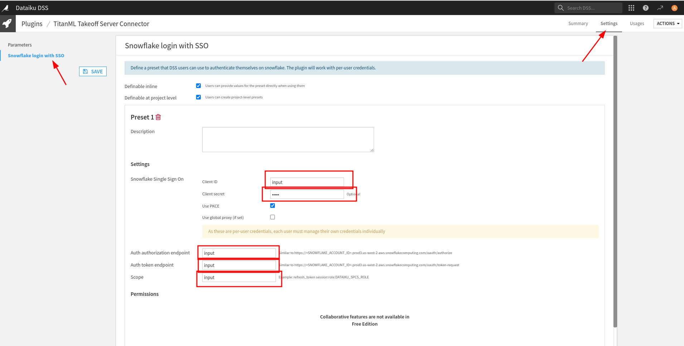
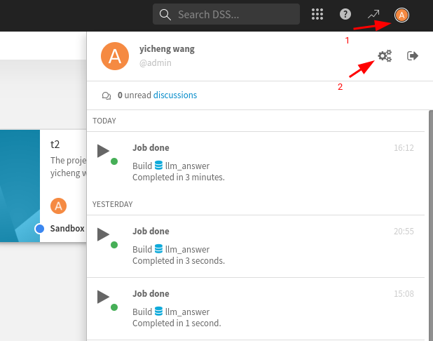
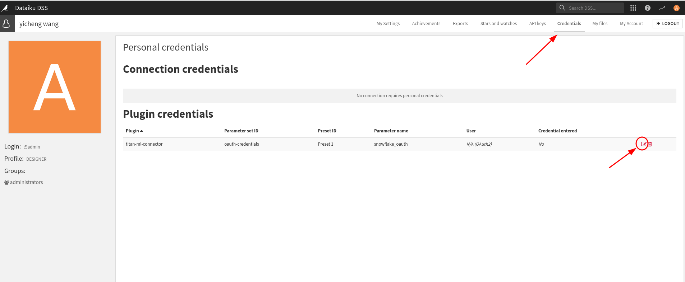
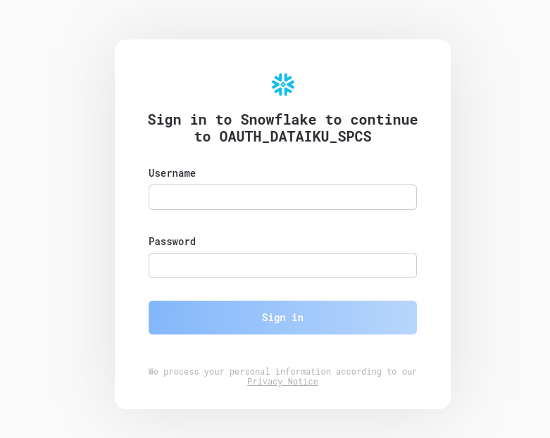
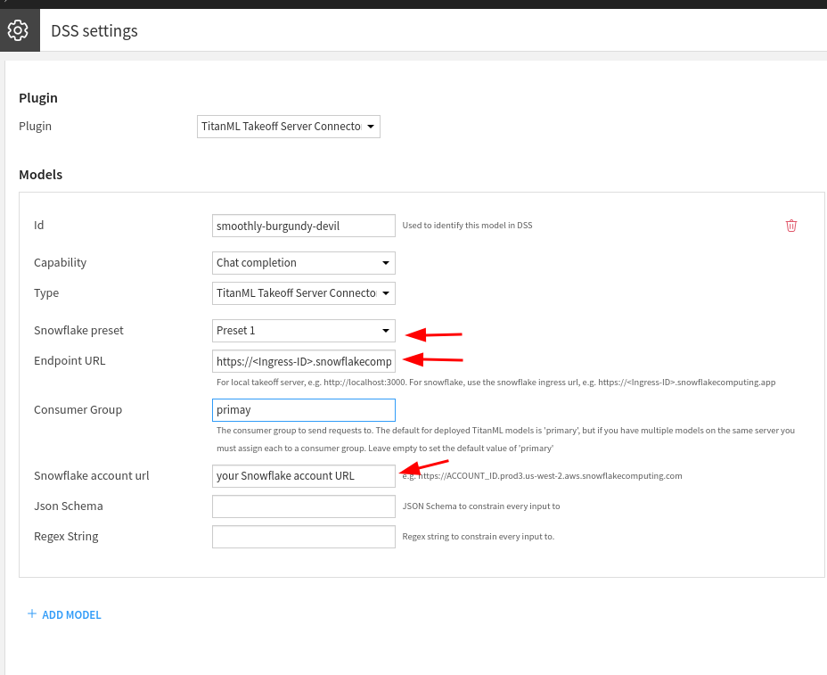

# Integrating Dataiku with Snowflake Snowpark Container Service

This guide walks you through an example of how to authenticate Dataiku with Snowflake Snowpark Container Service. This is particularly useful for clients using Snowflake as the compute provider and Dataiku to run LLM mesh.

## Prerequisites

- Snowflake setup is complete, and you can access a generation model through the Snowflake ingress URL.
- Dataiku DSS instance is installed and running.
- Dataiku Takeoff plugin is installed.

## Step 0: Gather Required Variables for Authentication

### Client ID and Client Secret

To retrieve the Client ID and Client Secret, run the following SQL command in `setup_01_dataiku.sql`:

```sql
CALL SYSTEM$SHOW_OAUTH_CLIENT_SECRETS('OAUTH_DATAIKU_SPCS');
```

Store these values securely for future use.

### Snowflake Account URL

Retrieve the Snowflake account URL from the Snowflake application. It will look something like this:

```
https://<SNOWFLAKE_ACCOUNT_ID>.prod3.us-west-2.aws.snowflakecomputing.com
```

### Snowflake Takeoff Ingress URL

To get the ingress URL, run the following SQL command in `takeoff_service.sql`:

```sql
SHOW ENDPOINTS IN SERVICE TAKEOFF_SERVICE;
```

## Step 1: Configure the Plugin in Dataiku

1. Go to the plugins page in Dataiku.
2. Find the "TitanML Takeoff Server Connector" plugin.
3. Click on "Settings" and select "Snowflake login with SSO".

   

4. Fill out the form with the information gathered in Step 0:

   - **Client ID**: Your Client ID.
   - **Client Secret**: Your Client Secret.
   - **Auth Authorization Endpoint**: `<snowflake account url>/oauth/authorize`
   - **Auth Token Endpoint**: `<snowflake account url>/oauth/token-request`
   - **Scope**: For example, `refresh_token session:role:CONTAINER_USER_ROLE`

5. Save the settings.

## Step 2: Set Up Credentials in Dataiku

1. Click on your profile icon and navigate to `Profile and Settings`.



2. Go to the `Credentials` section. You should see a screen similar to this:



3. Click the edit icon next to the credentials.
4. Click "OK". This should redirect you to the Snowflake SSO login page:



5. Complete the login process. Once finished, you will be redirected back to Dataiku.

## Step 3: Create a Connection

Now that authentication is set up, we can create a connection as usual. You should see a form similar to this:



Fill in the following fields with the correct information:

- **Snowflake Preset:** Select the preset we created in Step 1.
- **Endpoint URL:** Enter the Takeoff ingress URL provided by the Snowpark Container Service.
- **Snowflake Account URL:** Use the Snowflake account URL obtained in Step 0.

With the connection established, you can now run LLM mesh using Dataiku with Snowflake as the compute provider.
